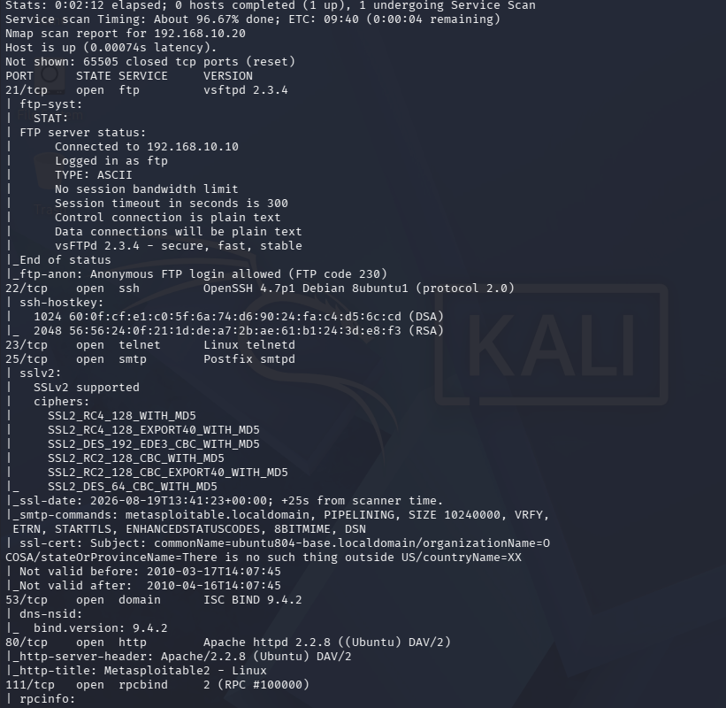
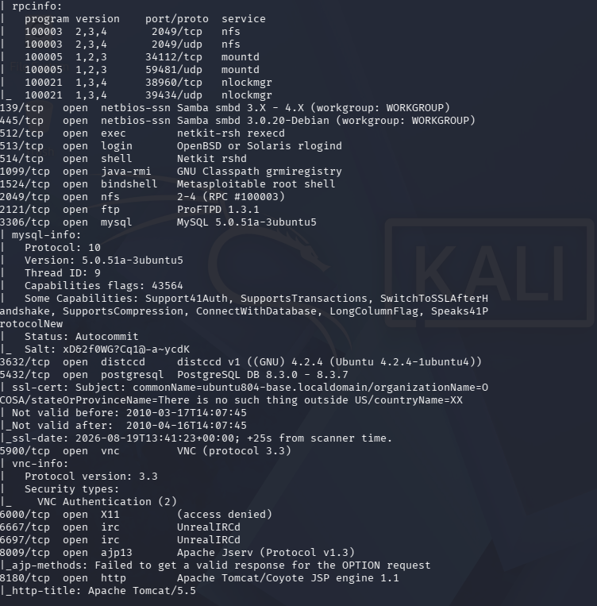
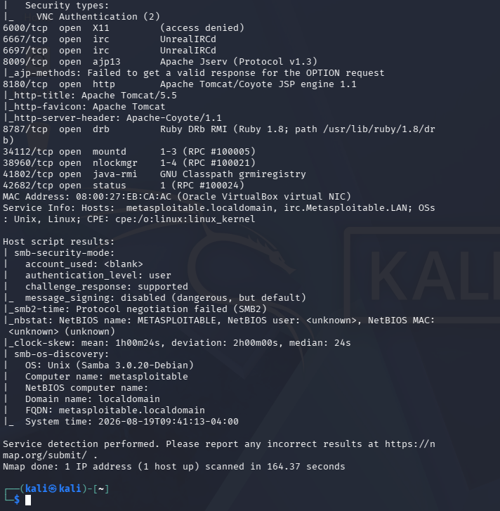

# 01 - Reconnaissance (Nmap Service Scan)

> Full TCP service/version scan of Metasploitable2 from Kali, establishing the attack surface for subsequent exercises.


---

## Objective

Enumerate open ports and running service versions on the target to identify candidates for the following exercises. This corresponds to the **Reconnaissance** phase of the Cyber Kill Chain and **Active Scanning (T1595)** in MITRE ATT&CK.

---

## Execution

```bash
sudo nmap -sV -sC -p- -T4 -n 192.168.10.20 -oN metasploitable2_scan.txt
```

- `-sV` — service/version detection
- `-sC` — default NSE scripts (banners, basic enumeration)
- `-p-` — tells Nmap to scan all 65,535 TCP ports on the target machine. By default, Nmap only scans the 1,000 most common ports. Using -p- ensures that no hidden or non-standard services running on higher-numbered ports are missed during the reconnaissance phase.
- `-T4` — faster timing, appropriate for a local lab network
- `-n` — skip DNS resolution (no resolver configured in the attacker VM)

Scan duration: 164.37 seconds. 

---

## MITRE ATT&CK Mapping

| Tactic | Technique | Technique ID |
|---|---|---|
| Reconnaissance | Active Scanning: Vulnerability Scanning | T1595.002 |
| Discovery | Network Service Discovery | T1046 |

---

## Few exemples of the results

```

PORT     STATE SERVICE     VERSION
21/tcp   open  ftp         vsftpd 2.3.4
22/tcp   open  ssh         OpenSSH 4.7p1 Debian 8ubuntu1 (protocol 2.0)
23/tcp   open  telnet      Linux telnetd
25/tcp   open  smtp        Postfix smtpd
53/tcp   open  domain      ISC BIND 9.4.2
80/tcp   open  http        Apache httpd 2.2.8 ((Ubuntu) DAV/2)
111/tcp  open  rpcbind     2 (RPC #100000)
139/tcp  open  netbios-ssn Samba smbd 3.X - 4.X (workgroup: WORKGROUP)
445/tcp  open  netbios-ssn Samba smbd 3.0.20-Debian (workgroup: WORKGROUP)
512/tcp  open  exec        netkit-rsh rexecd
513/tcp  open  login       OpenBSD or Solaris rlogind
514/tcp  open  shell       Netkit rshd
1099/tcp open  java-rmi    GNU Classpath grmiregistry
1524/tcp open  bindshell   Metasploitable root shell
2049/tcp open  nfs         2-4 (RPC #100003)
2121/tcp open  ftp         ProFTPD 1.3.1
3306/tcp open  mysql       MySQL 5.0.51a-3ubuntu5
3632/tcp open  distccd     distccd v1 ((GNU) 4.2.4 (Ubuntu 4.2.4-1ubuntu4))
5432/tcp open  postgresql  PostgreSQL DB 8.3.0 - 8.3.7
5900/tcp open  vnc         VNC (protocol 3.3)
6000/tcp open  X11         (access denied)
6667/tcp open  irc         UnrealIRCd
6697/tcp open  irc         UnrealIRCd
8009/tcp open  ajp13       Apache Jserv (Protocol v1.3)
8180/tcp open  http        Apache Tomcat/Coyote JSP engine 1.1
8787/tcp open  drb         Ruby DRb RMI (Ruby 1.8; path /usr/lib/ruby/1.8/drb)
```

Additional notes from script output:
- FTP (21): anonymous login allowed (`FTP code 230`)
- SMB (139/445): `message_signing: disabled (dangerous, but default)`, OS identified as Samba 3.0.20-Debian
- SMTP (25): supports `VRFY` (username enumeration)
- rpcinfo revealed NFS/mountd/nlockmgr RPC services

Full raw output saved locally as `metasploitable2_scan.txt` on the Kali VM (not committed to this repo — see [Evidence](#evidence)).

---

## Attack Surface Triage

Findings prioritized by exploitability, grouped for planning follow-up exercises:

### High priority — known backdoors / unauthenticated RCE

| Port | Service | Why it matters |
|---|---|---|
| 21 | vsftpd 2.3.4 | Backdoored source distribution, 2011 (CVE-2011-2523) — supply-chain compromise |
| 1524 | bindshell | A root shell is already listening, no exploitation needed |
| 6667/6697 | UnrealIRCd | Backdoored source distribution, 2009–2010 |
| 3632 | distccd | Unauthenticated RCE (CVE-2004-2687) |
| 8787 | Ruby DRb | Unauthenticated remote code execution via DRb protocol |

### Medium priority — weak/default authentication or known CVEs

| Port | Service | Why it matters |
|---|---|---|
| 23 | Telnet | Cleartext credentials |
| 139/445 | Samba 3.0.20 | `usermap_script` RCE (CVE-2007-2447) |
| 3306 | MySQL 5.0.51a | Historically no root password set |
| 5900 | VNC | Weak authentication |
| 8180 | Tomcat | Commonly default manager credentials |

### Low priority — information disclosure / enumeration only

Ports 111 (rpcbind), 2049 (NFS), 25 (SMTP VRFY) — no direct exploitation path identified yet, but useful for building a fuller picture of the target (users, exported shares, RPC services).

---

## Detection

This scan itself is a detectable event: a single source IP generating connections across ~1000 ports in under three minutes is a textbook port-scan signature. On a monitored network this should trigger:
- IDS/IPS alerts (e.g., Snort/Suricata port-scan preprocessors)
- Firewall/flow-log anomalies (high number of distinct destination ports from one source in a short window)

No Sigma/YARA rule written yet for this — candidate for a follow-up exercise once I cover network-based detection.

---

## Mitigation and Prevention

- Disable/uninstall unused services (most of the above should never be exposed on a production host)
- Network segmentation — none of these services should be reachable from an untrusted network
- Rate-limiting/alerting on port-scan behavior at the firewall or IDS level
- Regular vulnerability scanning from the defender's side, to catch this exposure before an attacker does

---

## Evidence





---

## Notes / Open Questions

- First scan attempt was interrupted (`Ctrl+C`) at 96.67% completion after pressing a key to check progress — not an Nmap failure, just an accidental interrupt. Re-run completed cleanly.
- Next exercise: exploitation of vsftpd 2.3.4 backdoor (port 21) — see `02-vsftpd-backdoor.md`.
