# 05 - ARP Cache Poisoning & Man-in-the-Middle

> Defeating a Linux ARP hardening default by poisoning an already-established relationship, comparing a naive execution against a properly executed bidirectional MITM, then investigating the same incident from the defender's side with no knowledge of the attack.


---

## Part 1: Attack

Structured around the Cyber Kill Chain (see [frameworks/cyber-kill-chain.md](../../../frameworks/cyber-kill-chain.md)). This exercise involves a third host, `alpine-endpoint` (192.168.10.40), running Alpine Linux in live/diskless mode on the same `LabCyber` internal network described in [00-environment.md](00-environment.md), in addition to Kali and Metasploitable2.

### Objective

Position Kali as a transparent man-in-the-middle between Metasploitable2 (192.168.10.20) and alpine-endpoint (192.168.10.40), first attempting it the way an inexperienced attacker would, then executing it the way a competent one would, to compare what each leaves behind on the wire and to demonstrate concrete impact (plaintext credential interception), not just the poisoning mechanism in isolation.

### Reconnaissance

Unlike prior exercises, reconnaissance here targeted host behavior rather than service banners. An initial `arpspoof` attempt against an IP Metasploitable2 had never communicated with failed to alter its ARP table. Checking the relevant kernel setting confirmed why:

```
cat /proc/sys/net/ipv4/conf/eth0/arp_accept
0
```

`arp_accept=0` is the Linux kernel default: gratuitous ARP replies are not permitted to create a **new** entry in the ARP table for an IP the host has never resolved before. It says nothing about updating an entry that already exists. A prior, ordinary ping between Metasploitable2 and alpine-endpoint had already caused both hosts to mutually resolve each other's real MAC address, confirmed on both ends before any attack was attempted:

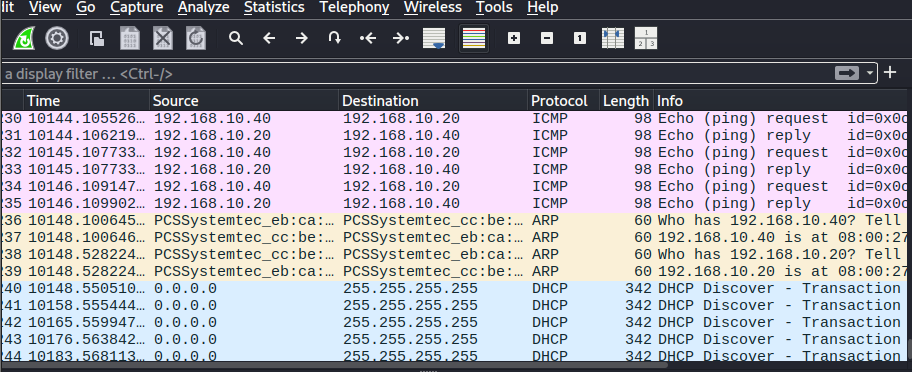

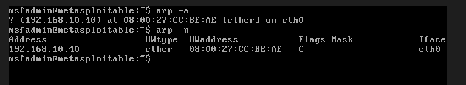

This is the gap: `arp_accept=0` only protects a host from being told about an IP it has never met. It does nothing to protect a relationship that already exists, and on any real network a host's most persistent relationship is with its default gateway, which by definition it always already knows.

### Weaponization

`arpspoof` (from the `dsniff` suite) was chosen, the same tool used to confirm the mechanism above. Two properties of the tool mattered for planning this attack:

- It must run continuously. A forged ARP reply is not permanent, it competes with the real host's own legitimate replies for whichever one the victim's kernel accepted most recently. Stopping the tool even briefly lets the correct binding win the race back.
- It only forges a lie in one direction per invocation (`arpspoof -t <target> <impersonated-host>`). Achieving a full bidirectional MITM, where both victims believe Kali is the other party, requires two separate `arpspoof` processes running in parallel, one per direction, each in its own terminal.

### Delivery

The forged ARP replies themselves, sent by `arpspoof` at roughly 1-2 second intervals for the duration of each test.

### Exploitation

**Attempt 1: naive.** A single `arpspoof -i eth0 -t 192.168.10.20 192.168.10.40` was run, poisoning only Metasploitable2's table, with no other configuration on Kali. The ARP table update itself succeeded, defeating `arp_accept=0` as expected:

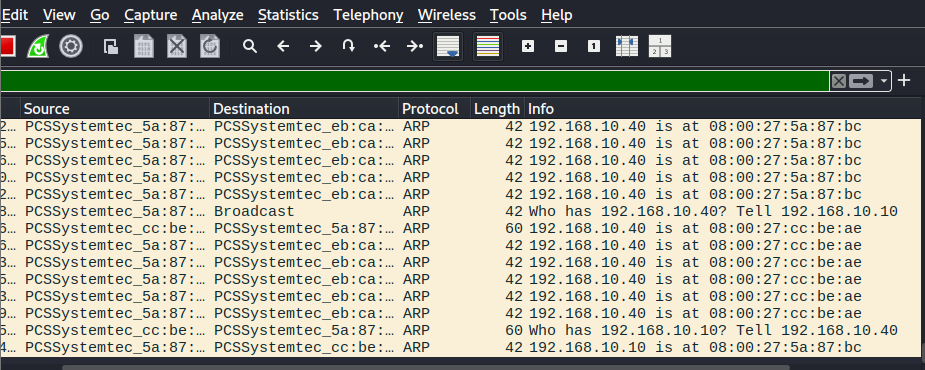

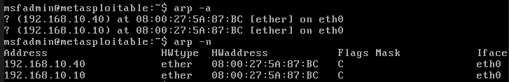

But a ping test between the two victims showed 84-94% packet loss in both directions, not the silent interception a MITM implies:

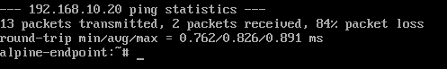
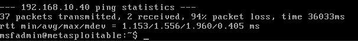
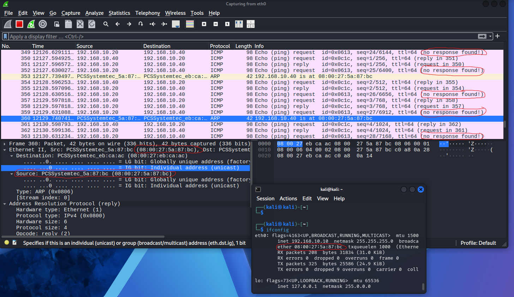

The cause: Kali's kernel had `ip_forward` disabled (`0`, its default), so when a victim addressed a packet to Kali's MAC (believing it was the other victim), Kali received it and silently discarded it rather than relaying it. The naive version of this attack does not eavesdrop, it produces a partial denial-of-service, because the attacker becomes a black hole for redirected traffic rather than a relay.

An early, separate pitfall is worth naming here because it nearly produced a false positive: a ping tested immediately after poisoning only one direction, without `arpspoof` actively running at that exact moment, succeeded at 100% packet loss with the traffic apparently visible in Kali's capture. Inspecting that frame's Ethernet header showed both the real source and real destination MAC of the two victims, Kali's MAC appeared nowhere in it. That traffic was never routed through Kali at all, it was only visible because VirtualBox's internal network delivers a copy of every frame to every attached interface (hub-like behavior), and Wireshark's promiscuous capture shows all of it regardless of the destination MAC. Passive visibility on a hub-like segment is not proof of interception; only a frame whose own Ethernet source or destination is the attacker's MAC is.

**Attempt 2: correct.** Two changes were made on Kali before repeating the attack:

```
sudo sysctl -w net.ipv4.ip_forward=1
sudo sysctl -w net.ipv4.conf.eth0.send_redirects=0
sudo sysctl -w net.ipv4.conf.all.send_redirects=0
```

`ip_forward=1` lets Kali actually relay the packets it now receives instead of dropping them. On its own, this reintroduced a different tell: Linux's default router behavior sends an ICMP Redirect back to a sender whenever it forwards a packet toward a destination on the same local segment as itself, exactly what happens here, since Metasploitable2 and alpine-endpoint share a subnet with no real router between them:

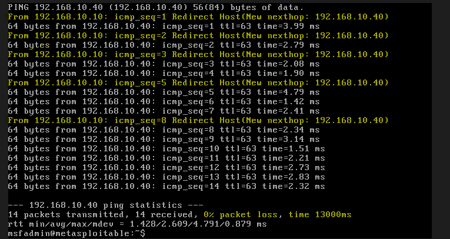
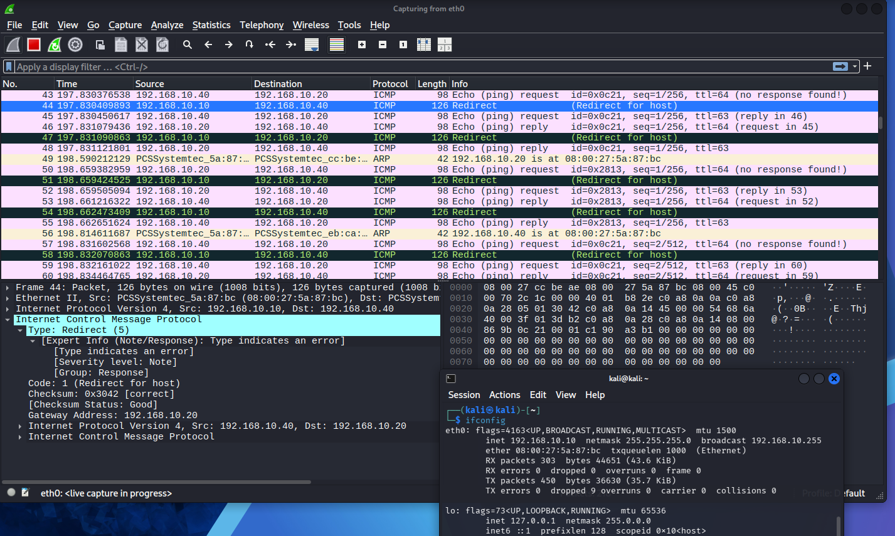

`send_redirects=0` suppresses that specific announcement without disabling forwarding itself. With both `arpspoof` processes running simultaneously, one per direction, the same ping test then completed with 0% packet loss on both sides and no Redirect traffic:

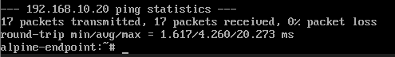
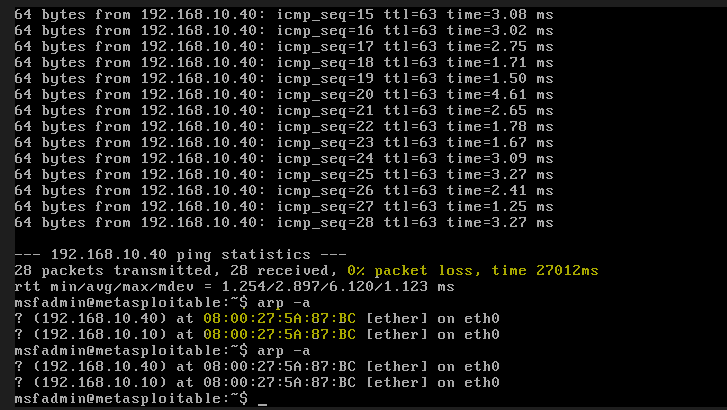
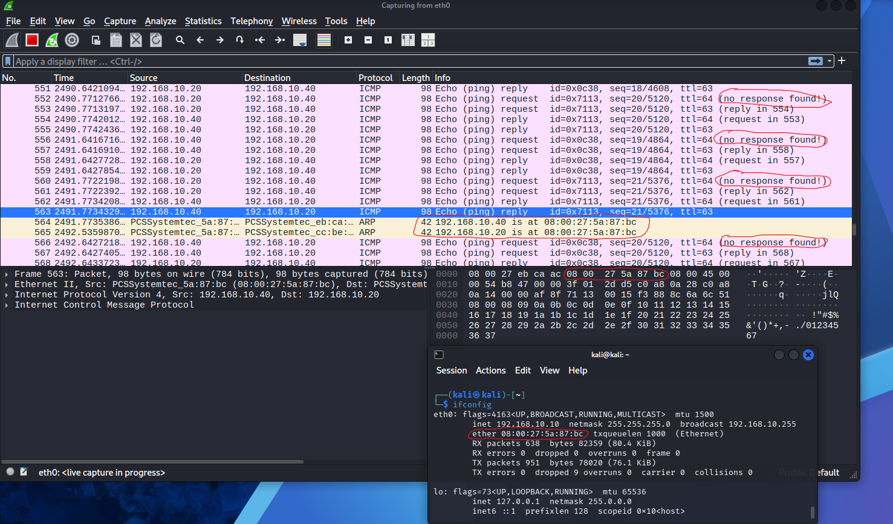
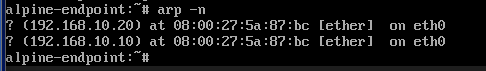

Two side effects persisted even in this corrected version, both measured under matched system load (Wireshark capturing in both cases, to avoid attributing ordinary VM resource contention to the attack itself):

- Average ICMP round-trip latency increased from 0.993 ms (no MITM) to 1.779 ms (MITM active), roughly a 79% increase, consistent with the extra hop and processing overhead of relaying through a general-purpose host rather than a switch:

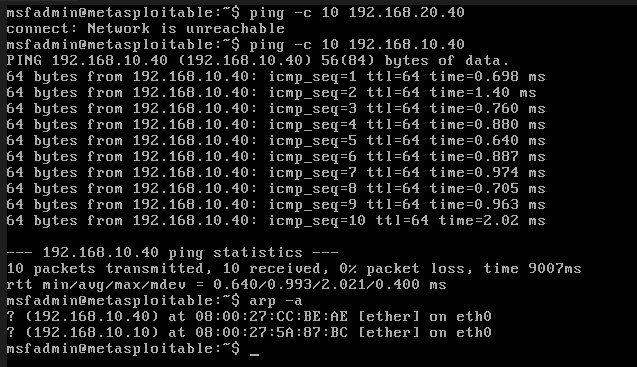
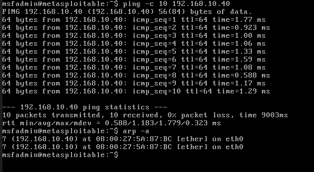

- The relayed FTP session (see Actions on Objectives below) showed TCP retransmissions and duplicate ACKs, unusual for a same-subnet, low-latency connection that never touches a real router:

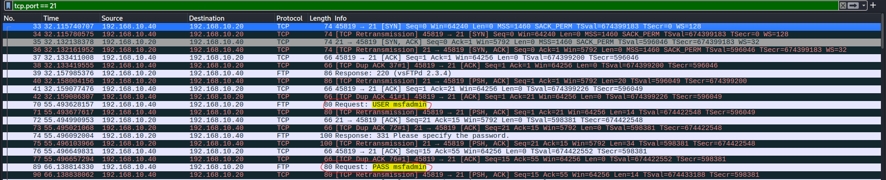

### Installation

Not applicable in the conventional sense, no persistent artifact was installed on either victim. What is worth documenting here instead is the attack tool's own exit behavior, since it functions as a form of anti-forensic cleanup. Interrupting `arpspoof` (`Ctrl+C`) does not just terminate the process, it makes the tool send one final, **truthful** ARP reply restoring the victim's table to the correct binding before exiting:

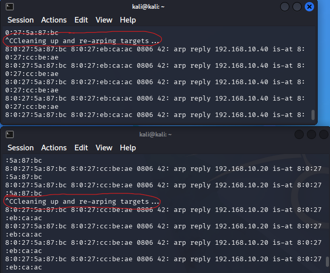
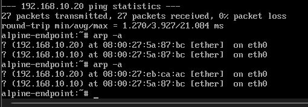

A second, unrelated effect produces a similar-looking result for a different reason: Kali's own (legitimate) ARP entry on Metasploitable2 also disappeared shortly after the attack stopped, not because anything corrected it, but because Kali stopped generating any traffic and the entry aged out of the cache from ordinary inactivity:

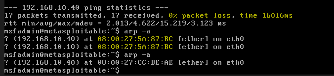

These are two distinct mechanisms (deliberate correction vs. passive cache expiry) that produce a similar practical outcome: very little ARP-table evidence survives for long after the attack tool stops running.

### Command and Control

The relay itself is the channel. With `ip_forward=1`, Kali continuously and transparently forwards every packet exchanged between the two victims, giving the attacker a live, real-time view of (and, though not exercised here, the ability to modify) the entire conversation, without either party's knowledge.

### Actions on Objectives

To demonstrate concrete value rather than just mechanism, an FTP login was captured while the corrected MITM was active. alpine-endpoint's minimal live image had no `telnet` client, so `nc 192.168.10.20 21` was used instead, a raw TCP connection is sufficient against FTP's plain-text control channel:

```
USER msfadmin
PASS msfadmin
230 Login successful.
```

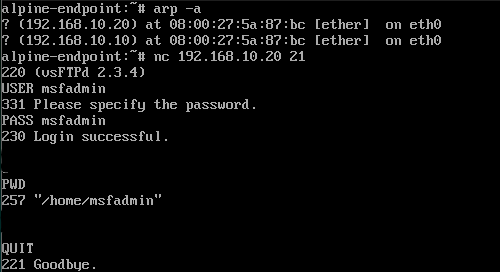
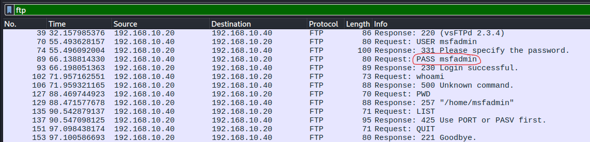

Because on-path visibility (via the hub-like segment behavior noted above) is not by itself proof of interception, one of these packets was checked directly: the `230 Login successful` response leaving Metasploitable2 carries Metasploitable2's own real MAC as source, but is addressed at Ethernet level to **Kali's** MAC, not alpine-endpoint's:

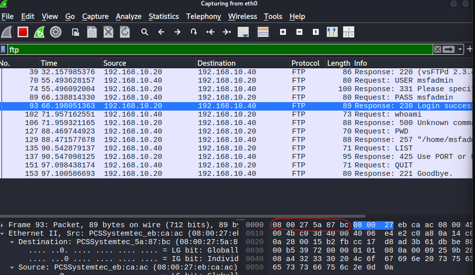

This is the direct proof the naive attempt could not offer: Metasploitable2 itself, acting on its poisoned ARP table, handed its response to the attacker first. Kali then had to relay it onward to the real alpine-endpoint for the session to complete successfully, which it did.

### MITRE ATT&CK Mapping

| Tactic | Technique | Technique ID |
|---|---|---|
| Credential Access | Adversary-in-the-Middle: ARP Cache Poisoning | T1557.002 |
| Collection | Network Sniffing | T1040 |
| Defense Evasion | Indicator Removal | T1070 |

### Impact Observed

- `arp_accept=0` was defeated, not by breaking it, but by targeting the one condition it does not cover: an already-established relationship
- A naively executed attempt (no IP forwarding) is self-defeating as an interception technique, it produces a distinguishable partial denial-of-service instead of silent eavesdropping
- A properly executed attempt achieved a fully functional, bidirectional relay with 0% packet loss and no ICMP Redirect artifact, but still measurably increased latency (~79%) and introduced TCP retransmissions
- Plaintext FTP credentials (`msfadmin:msfadmin`) were captured in transit and confirmed, at the Ethernet header level, to have been genuinely relayed rather than passively observed
- The attack tool actively restores the ARP tables it poisoned on exit, an anti-forensic behavior distinct from the ordinary cache expiry that also occurs

---

## Part 2: Defense (Threat Hunting)

Follows the shape of the NIST incident response lifecycle. This investigation was conducted with access only to Metasploitable2 and alpine-endpoint, no access to Kali, and no foreknowledge of what Part 1 actually did.

### Trigger

Operations had already looked into a vague instability report between 192.168.10.20 and 192.168.10.40 (intermittent slowness, self-resolving) before this ever reached security. During their own checks, they noticed something that made them prefer a second opinion rather than closing it as routine: the MAC address associated with `192.168.10.40` in Metasploitable2's ARP table was different across two checks taken minutes apart, with no explanation they could account for. That observation, and access to both named hosts, is the entire starting point.

### Investigation

Two options were ruled out before choosing a method, and the reasoning matters as much as the choice itself:

- **Re-checking the ARP table directly** was considered and rejected as a primary source. ARP entries are among the most volatile state on a host, they expire naturally within minutes of inactivity, and (as later confirmed independently in Part 1) a poisoning tool can restore the correct value the moment it stops running. A single point-in-time table read, taken after the fact, could not be trusted to still reflect whatever caused the original report.
- **An unscoped packet capture across the network** was also rejected. With no SIEM and no visibility beyond these two hosts, and no specific hypothesis yet, capturing broadly would produce noise with no way to know what to look for in it.

Given the report described a recurring, self-resolving symptom rather than a single resolved event, a targeted live capture was judged reasonable: catch the next recurrence directly. Tool availability was checked first, `tcpdump` exists on Metasploitable2, `telnet` and any packet capture tooling do not exist on the minimal alpine-endpoint image. The investigation proceeded from Metasploitable2 only.

A first capture (`tcpdump -i eth0 -w captura.pcap`) used the tool's default snapshot length (96 bytes), truncating most packets well before any application payload. It was restarted with `-s 0` to capture full packets, which the traffic below was pulled from.

Reading the capture without a filter first, to get an overview before narrowing:

```
tcpdump -n -r captura.pcap
```

surfaced a pattern with no clear cause yet, but suspicious on its face: repeated ARP replies for both hosts' addresses, none of them preceded by a matching request, and, cross-checking the two, both different IP addresses resolving to the **same** MAC address:

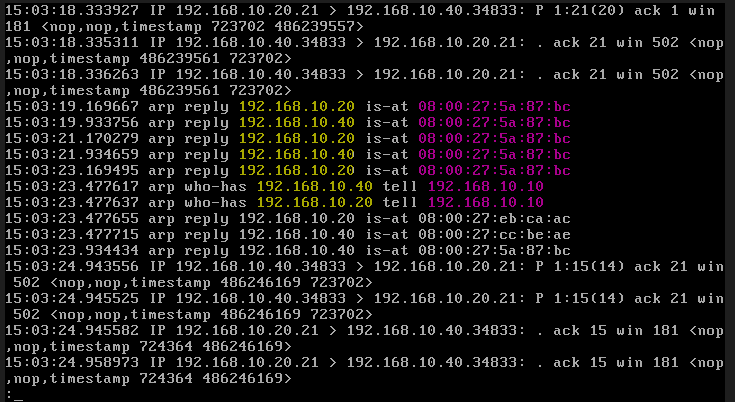

Ordinary ARP traffic is request-driven and only as frequent as actual need. Both properties observed here (unsolicited, repeated, and converging on one MAC for two distinct IPs) do not fit that baseline.

Narrowing to the TCP conversation between the two named hosts and printing payload content (`-A`) to see what, if anything, was exposed:

```
tcpdump -n -r captura.pcap -A port 21
```

surfaced a complete, plaintext FTP login:

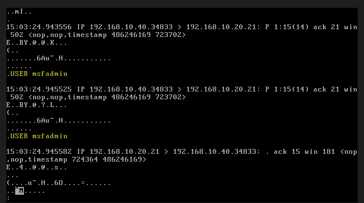
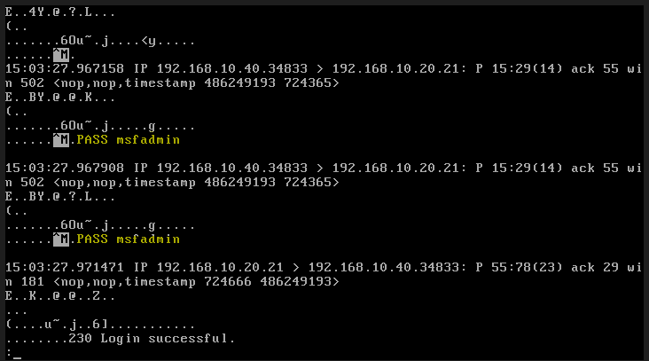

On its own, this only demonstrates that FTP is an insecure protocol, anyone with legitimate access to this exact host and this exact capture can read it. It does not, by itself, prove a third party was actively positioned to intercept it in real time. Establishing that required going back to the earlier ARP anomaly and correlating it directly against this specific session, rather than treating the two findings as separate. Re-reading the same port 21 traffic with link-layer addresses shown (`-e`):

```
tcpdump -n -e -r captura.pcap port 21
```

showed every packet in the exchange taking two hops instead of one, first addressed to the suspect MAC, then re-sent from that same MAC toward the real destination, in both directions of the conversation:

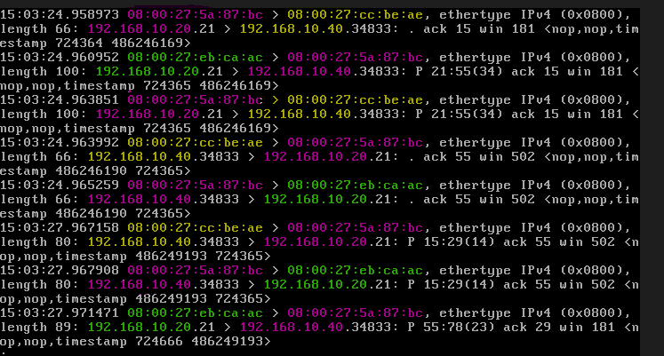

A two-hop delivery path is not inherently suspicious, that is exactly what a legitimate router does. What makes it suspicious here is the topology: 192.168.10.20 and 192.168.10.40 share the same `/24`, with no router between them. Traffic between them has no legitimate reason to touch a third MAC address at all, let alone the same one that had already been seen fraudulently claiming ownership of both endpoints' IP addresses.

### Findings

- **Who**: MAC address `08:00:27:5a:87:bc`. It cannot be tied to an account or process from host evidence alone, but it can be tied to an IP: across the full capture, this MAC is the only one ever seen for `192.168.10.10`, with no competing claim for that specific address, unlike `.20` and `.40`. That consistency (contested for two addresses, uncontested for a third) points to `192.168.10.10` as the underlying host's own legitimate identity.
- **What**: ARP cache poisoning used to establish a bidirectional on-path position between the two hosts, exploited to intercept an FTP authentication exchange in cleartext.
- **Where**: the segment between 192.168.10.20 (Metasploitable2, FTP service) and 192.168.10.40 (alpine-endpoint, the connecting client), observed from Metasploitable2's own vantage point.
- **Why**: Ethernet/ARP has no built-in authentication, any host on the segment can claim ownership of any IP address on it. Whatever hardening exists at the OS level (Metasploitable2 does not accept ARP-learned entries for addresses it has never resolved) does not protect a relationship the host already has, such as its established peer at `.40`.
- **When**: within the captured window (all packet timestamps fall between 15:03:18 and 15:03:27 in this capture); the underlying issue is recurring per the original report, not a single isolated event.

Confidence is high. Three independent signals (the unsolicited/duplicate ARP pattern, the two-hop delivery path specific to a subnet with no legitimate router, and both correlating to the same MAC address carrying the actual sensitive session) corroborate the same conclusion.

### Containment

The instinctive first response is to isolate or firewall-block `192.168.10.10`. Naming why that falls short: it treats the symptom as the problem. ARP has no authentication at the protocol level, any device joining this same broadcast segment, whether the same machine with a changed MAC or a different one entirely, can repeat the identical attack against these same two hosts within seconds. Removing one address does not restore trust in the current state of either victim's ARP table, and it does nothing to prevent recurrence.

What actually closes the exploitation path is removing the segment's ability to accept forged bindings in the first place, not reacting to a single instance of it:

- **Dynamic ARP Inspection (DAI)** on a managed switch, paired with DHCP snooping, validates every ARP reply against a trusted IP-to-MAC binding table before it ever reaches a victim's NIC, and drops forgeries at the switch itself. This is the control that actually matches the scope of the problem (any host, any time), rather than a specific IP.
- Where DAI is not available, static ARP entries for a small number of known-critical hosts (each victim's ARP table pinned for the other, and for the gateway) prevent that specific binding from being overwritten at all, at the cost of not scaling past a handful of hosts.
- Segmenting critical hosts onto separate VLANs limits the blast radius. ARP poisoning cannot cross a broadcast domain boundary, an attacker on one segment cannot poison a host on another.

This lab's own network is a flat VirtualBox internal network with no manageable switch, so DAI specifically could not be implemented or demonstrated here. That gap is named directly rather than glossed over, see Notes below.

### Recovery

- Clear the ARP cache on both Metasploitable2 and alpine-endpoint and force a fresh, legitimate resolution
- Rotate the `msfadmin` FTP credential, and any other credential that may have transited this segment in cleartext during the affected window
- Migrate the FTP service to an encrypted alternative (FTPS or SFTP), so a recurrence of the same interception technique captures nothing usable
- If `192.168.10.10` does not correspond to an authorized asset, remove it from the network entirely

### Detection

- The manual correlation performed in this investigation (unsolicited/repeated ARP replies, one MAC claiming two IPs, a two-hop delivery path with no legitimate router to explain it) is reproducible, but it is retrospective and point-in-time by nature, it depends on a capture having been taken during the window the attack was active.
- `arpwatch`, purpose-built for exactly this pattern, would flag it continuously and in real time rather than requiring a manual pcap review after the fact. A Sigma rule targeting its output is included: [arp-cache-poisoning-duplicate-mac.yml](../../../detection/sigma/arp-cache-poisoning-duplicate-mac.yml). It is written from the pattern confirmed in this exercise, not validated against a live `arpwatch` deployment, this lab does not currently run one.
- Wireshark's own built-in Expert Information ("Duplicate IP address configured") flagged the same underlying conflict independently during Part 1, useful as a cross-check against a second, independent tool reaching the same conclusion from the same class of evidence:

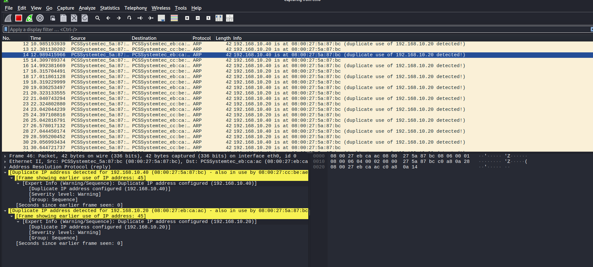
- None of the above is available at the switch level in this lab (see Containment), which is the earliest and most reliable point this specific attack could be caught, before a single forged reply ever reaches a victim's NIC.

### Mitigation and Prevention

- Deploy Dynamic ARP Inspection and DHCP snooping on any managed switch this network design gets replicated on outside the lab
- Run continuous ARP monitoring (`arpwatch` or equivalent) on any segment carrying sensitive traffic
- Migrate cleartext protocols (FTP, Telnet) to their encrypted equivalents, limiting what a future successful interception, if one occurs anyway, actually yields
- Consider 802.1X port-based authentication to prevent unauthorized devices from joining the segment at all
- Where dynamic inspection is not available, static ARP entries for a small, defined set of critical hosts, as a narrowly scoped compensating control, not a general solution

---

## Conclusion

### Diamond Model

| Vertex | This incident |
|---|---|
| Adversary | The operator at 192.168.10.10 |
| Capability | Bidirectional ARP cache poisoning of an already-established relationship, combined with IP forwarding to relay traffic transparently and ICMP redirect suppression to remove a routing-layer tell |
| Infrastructure | The Kali host itself, doubling as the poisoning source and the transparent relay for both directions of traffic |
| Victim | Metasploitable2 (192.168.10.20) and alpine-endpoint (192.168.10.40), and by extension the `msfadmin` FTP credential shared between them |

Same shape as the previous exercise (one adversary, one piece of infrastructure, one victim pair), but the capability here is composite rather than a single exploit: the poisoning, the relay, and the evasion step are three distinct pieces of tradecraft chained together, and each was independently necessary for the "correct" execution to hold up under scrutiny.

### Pyramid of Pain

| Indicator | Example from this incident | Cost to the attacker of losing it |
|---|---|---|
| TTPs | Poisoning an already-established ARP relationship (bypassing `arp_accept=0`), combined with IP forwarding and ICMP redirect suppression | Extremely high, this is the actual tradecraft, and defeating it means rethinking the whole approach, not swapping a tool |
| Tools | `arpspoof` (dsniff) | Moderate, Ettercap, Bettercap, or a hand-written script achieve the identical protocol-level effect |
| Network Artifacts | The unsolicited/repeated gratuitous ARP pattern, one MAC answering for two IPs, the two-hop delivery path on a subnet with no legitimate router | Higher than this tier usually costs an attacker to lose. Unlike the ICMP Redirect (an implementation detail, successfully suppressed in Part 1), this artifact is structurally inseparable from ARP poisoning itself, there is no configuration change that removes it without also removing the attack |
| IP Addresses | 192.168.10.10 | Trivial, already covered in Containment, a new address defeats IP-based blocking instantly |

The Network Artifacts row is the most important line in this table, and it is why Containment above leads with Dynamic ARP Inspection rather than IP blocking: everything in the row above it (TTPs) is genuinely hard to change, but a defender rarely gets to detect a TTP directly, they detect its artifacts. Here, uniquely among the indicators recovered in this lab so far, the artifact and the TTP are close to the same thing. Suppressing the ICMP Redirect in Part 1 proved that *some* side effects of this attack are implementation details an attacker can engineer away. The ARP conflict pattern proved that at least one cannot be, which is precisely the distinction a threat hunter needs to know before deciding where to spend detection effort: not every "well-executed" attack is equally silent at every layer.

---

## Notes / Open Questions

- Whether Wireshark's "Duplicate IP address configured" warning would have appeared in earlier, separate capture sessions during Part 1 was inconclusive. The working theory is that this heuristic tracks state per continuous capture session and only fires once it has observed both the legitimate and the forged binding within that same session, but this was not confirmed against the earlier capture files directly.
- The latency and retransmission measurements in Part 1 carry a methodological caveat: the host running all three VMs has 8GB of RAM total, and Wireshark was capturing during both the baseline and attack measurements. The relative comparison (matched conditions on both sides) is sound, the absolute millisecond values are not clean-room numbers.
- Dynamic ARP Inspection, named in both Containment and Mitigation as the control that actually fits this problem, could not be tested in this lab. VirtualBox's internal network has no manageable switch to configure it on. This is a real gap between what is recommended and what could be demonstrated, not a hedge.
- Next exercise: pick from ROADMAP.md's Hands-On Labs section.
