# 06 - SSH Password Brute Force (Weak Credential Policy)

> Running a dictionary attack against SSH password authentication to recover a valid credential, then investigating the same activity from the defender's side and separating it from a legitimate user making ordinary password mistakes on the same server.


---

## Part 1: Attack

Structured around the Cyber Kill Chain (see [frameworks/cyber-kill-chain.md](../../../frameworks/cyber-kill-chain.md)). This exercise also uses the third host `alpine-endpoint` (192.168.10.40), running Alpine Linux in live/diskless mode on the same `LabCyber` internal network described in [00-environment.md](00-environment.md), as the source of legitimate SSH traffic against the target during the attack window.

### Objective

Recover a working SSH credential for Metasploitable2 by guessing passwords against the running service, and produce a realistic authentication log for the defensive investigation in Part 2, one that contains the attack mixed in with genuine user activity rather than an artificially clean burst.

### Reconnaissance

Port 22 was already recorded in [01-reconnaissance.md](01-reconnaissance.md). A focused re-scan confirmed the service and, more importantly, its version:

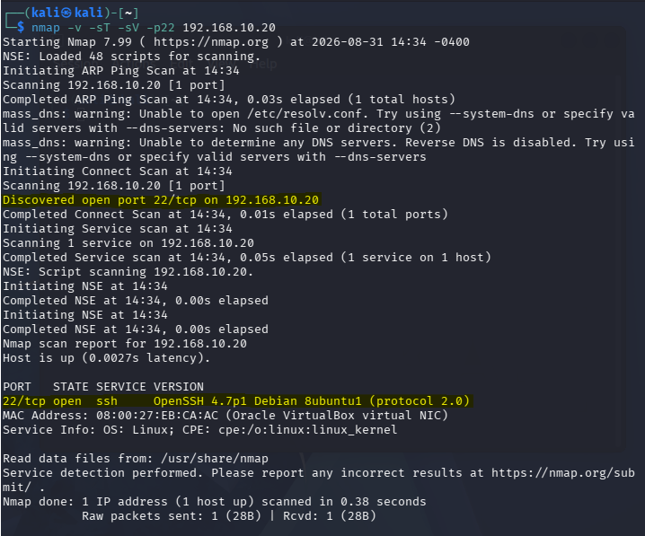

```
22/tcp open  ssh  OpenSSH 4.7p1 Debian 8ubuntu1 (protocol 2.0)
```

OpenSSH 4.7p1 dates from 2007. That single fact drives most of the tooling work in the next section: a server of that era negotiates a set of host key, key exchange, and MAC algorithms that current SSH clients disable or no longer ship at all. Encountering this is not a museum problem. Long-lived infrastructure that cannot be taken offline for upgrades is a permanent feature of real networks, and the skill of getting a modern toolchain to speak to a dated endpoint transfers directly (see [Why the Target Systems Are Old](../README.md#why-the-target-systems-are-old)).

Account names were enumerated from an existing `msfadmin` session by reading `/etc/passwd` and filtering for interactive shells:

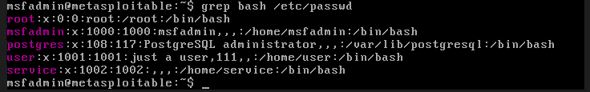

```
root:x:0:0:root:/root:/bin/bash
msfadmin:x:1000:1000:msfadmin,,,:/home/msfadmin:/bin/bash
postgres:x:108:117:PostgreSQL administrator,,,:/var/lib/postgresql:/bin/bash
user:x:1001:1001:just a user,111,,:/home/user:/bin/bash
service:x:1002:1002:,,,:/home/service:/bin/bash
```

`root`, `msfadmin`, and `user` were selected as valid targets. Three names that do not exist on the system (`admin`, `oracle`, `test`) were added to the target list on purpose, since a real brute-force campaign sprays common account names blindly and the resulting `invalid user` log entries are a distinct and useful signal for Part 2.

### Weaponization

The tool is [Hydra](https://github.com/vanhauser-thc/thc-hydra) 9.7, a network login guesser that authenticates against a live service one attempt at a time. This is an online attack: every guess is a real connection the target sees and logs, which is the opposite of an offline attack against a stolen password hash file, and it is the online case that leaves the evidence Part 2 works from.

Two wordlists were prepared on Kali:

- `usuarios.txt`: the six target account names above.
- `senhas-grande.txt`: the first 40 entries of `rockyou.txt` (the standard credential wordlist shipped with Kali, ordered by real-world frequency), with the string `msfadmin` appended so the run would land on the target's actual password after grinding through the common ones first.

Reaching the 2007 server took three separate rounds of algorithm negotiation troubleshooting, each a different layer of the SSH handshake:

**Host key algorithm.** A plain `ssh msfadmin@192.168.10.20` from Kali was refused before any password prompt. The server only offers `ssh-rsa` (SHA-1) and `ssh-dss` host keys, both disabled by default in current OpenSSH. Re-enabling them on the client:

```bash
ssh -o HostKeyAlgorithms=+ssh-rsa,ssh-dss msfadmin@192.168.10.20
```

**MAC algorithm.** Hydra does not use the system `ssh` binary, it links against `libssh`, and it failed at a different point, the negotiation of the per-packet integrity algorithm:

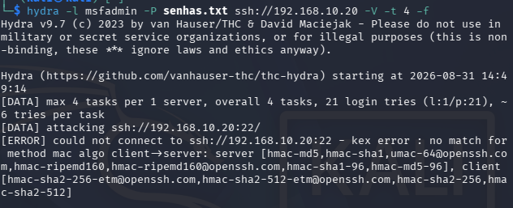

```
[ERROR] ... kex error : no match for method mac algo client->server:
server [hmac-md5,hmac-sha1,umac-64@openssh.com,hmac-ripemd160,...]
client [hmac-sha2-256-etm@openssh.com,hmac-sha2-512-etm@openssh.com,hmac-sha2-256,hmac-sha2-512]
```

The server offers only MD5, SHA-1, and RIPEMD-160 based MACs, the client offers only SHA-2 based ones, and there is no overlap. Hydra's SSH module accepts no algorithm options of its own, but `libssh` reads the user's `~/.ssh/config`, so the preferences were set there, covering all three negotiation layers at once:

```
Host 192.168.10.20
    MACs +hmac-sha1,hmac-md5
    KexAlgorithms +diffie-hellman-group1-sha1,diffie-hellman-group14-sha1
    HostKeyAlgorithms +ssh-rsa,ssh-dss
```

**DSA removal.** The legitimate-traffic host, `alpine-endpoint`, runs a much newer OpenSSH (10.3), and there `ssh-dss` is not a deprecated option to be re-enabled, it was removed from OpenSSH entirely in version 10.0. Naming it at all produces `Bad key types 'ssh-dss'` and invalidates the whole list. The server also presents an `ssh-rsa` host key, so dropping `ssh-dss` and keeping `+ssh-rsa` was sufficient:

```bash
ssh -o HostKeyAlgorithms=+ssh-rsa \
    -o KexAlgorithms=+diffie-hellman-group1-sha1,diffie-hellman-group14-sha1 \
    -o MACs=+hmac-sha1,hmac-md5 \
    msfadmin@192.168.10.20
```

The takeaway that generalizes: the distance between a current client and a dated server widens over time, and the same host can require different compatibility flags depending on which client generation is connecting to it.

### Delivery

Hydra was pointed at the SSH service with the two wordlists, four parallel workers, and no early-exit flag so it would run the full six-by-forty-one matrix rather than stopping at the first hit:

```bash
hydra -L usuarios.txt -P senhas-grande.txt ssh://192.168.10.20 -V -t 4
```

The `-t 4` cap matters against a server this old. Its `sshd` limits concurrent unauthenticated connections, and the default of sixteen parallel workers causes dropped connections and unreliable results.

### Exploitation

The attack was run in two passes. An initial smaller run, against `msfadmin` alone with a short handmade list, confirmed the approach and the algorithm-compatibility fixes worked end to end:

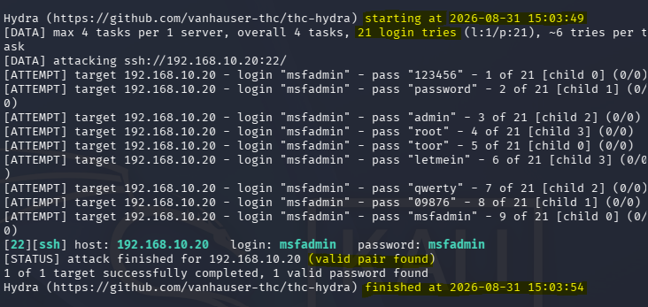

A packet capture on Kali during that first pass shows the network side of the attack. Filtered to the target and port 22, it is a rapid succession of short-lived TCP connections, each from a new source port, opened and torn down in under a second:

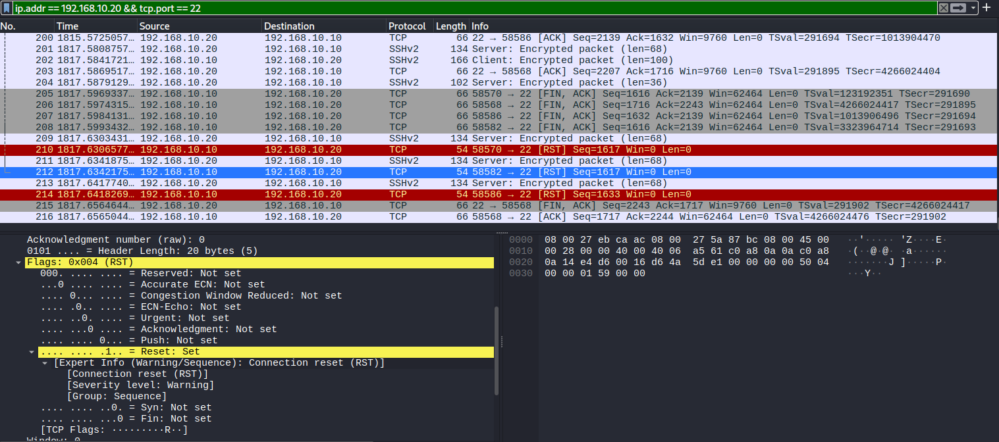

The Conversations view separates that burst from the earlier traffic: a handful of connections all starting within a fraction of a second of each other, distinct from the loosely spaced connections used while testing the compatibility flags:

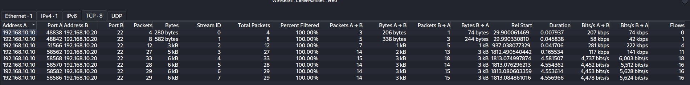

The capture shows the pattern, repeated connections to port 22 from one source in a short window, but not the content. SSH encrypts everything after the handshake, so the usernames, the passwords, and the pass or fail of each attempt are not visible on the wire. Those are only in the server's authentication log, which is what Part 2 works from. There are also fewer connections on the wire than there are guesses in the log, because SSH allows several authentication attempts per connection and the tool uses that.

The full run then worked through 246 attempts across all six usernames and recovered the same credential:

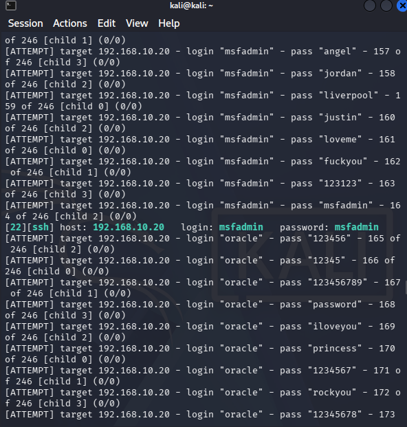

```
[22][ssh] host: 192.168.10.20   login: msfadmin   password: msfadmin
```

The password `msfadmin` is a vendor-style default: the account name reused as the password. A dictionary of the forty most common passwords plus that one guess was enough. No lockout, no throttling, and no delay slowed the run, which completed in roughly two minutes.

Each guess against the running service produces log lines on the target. A close view of the entries these runs generate, captured during the initial pass:

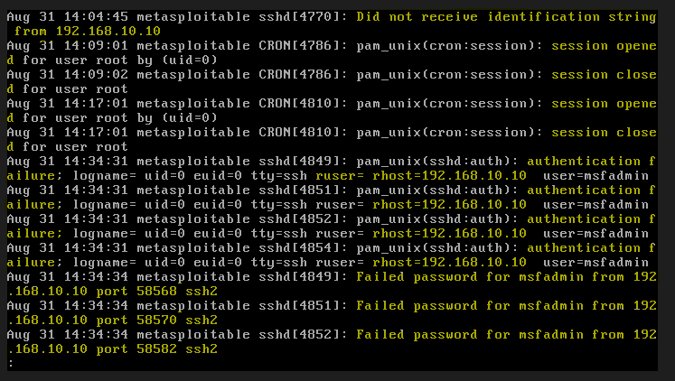
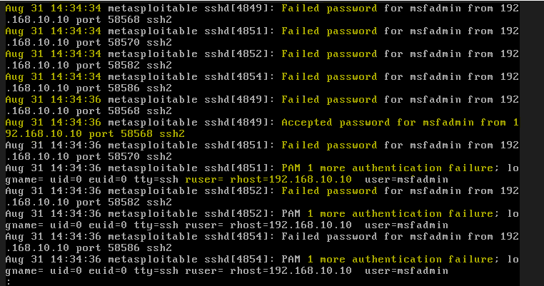

Every failed attempt writes two lines, one from PAM (`pam_unix(sshd:auth): authentication failure ... rhost=192.168.10.10`) and one from `sshd` itself (`Failed password for ... from 192.168.10.10 port ... ssh2`). The successful guess writes `Accepted password for msfadmin from 192.168.10.10`.

### Installation

No persistence was established in this exercise. From the recovered `msfadmin` account an attacker would typically add an SSH key to `~/.ssh/authorized_keys` or create a second account, and `msfadmin` can `sudo` to root, so either would be trivial. This was left out deliberately to keep the Part 2 investigation focused on the brute force itself.

### Command and Control

A single interactive SSH session as `msfadmin`, opened to confirm the credential works and closed immediately. No ongoing channel.

### Actions on Objectives

One valid credential recovered, giving interactive SSH access to a `sudo`-capable account.

Beyond that single result, the run was shaped to produce representative telemetry for Part 2. It targeted six usernames including three that never existed, and during the same window `alpine-endpoint` (192.168.10.40) ran a series of genuine `msfadmin` logins: some correct on the first try, some where the password was mistyped once or twice before succeeding, and one where it was entered wrong three times in a row and the connection was dropped. The resulting authentication log, [projects/ssh-bruteforce-detector/sample-data/auth.log](../../../projects/ssh-bruteforce-detector/sample-data/auth.log), therefore contains the attack interleaved in real time with ordinary user behaviour.

### MITRE ATT&CK Mapping

| Tactic | Technique | Technique ID |
|---|---|---|
| Reconnaissance | Active Scanning: Vulnerability Scanning | T1595.002 |
| Discovery | Account Discovery: Local Account | T1087.001 |
| Credential Access | Brute Force: Password Guessing | T1110.001 |
| Initial Access | Valid Accounts: Local Accounts | T1078.003 |
| Lateral Movement | Remote Services: SSH | T1021.004 |

### Impact Observed

- One working SSH credential recovered (`msfadmin:msfadmin`) from a 40-entry dictionary plus one targeted guess.
- Interactive access to a `sudo`-capable account, meaning effective root was one command away.
- The attack was loud: 269 failed authentications from a single source in a 2-minute 17-second window, against 6 usernames, 135 of them against accounts that do not exist.
- Nothing on the target rate-limited, delayed, or locked out the attempts.

---

## Part 2: Defense (Threat Hunting)

Follows the shape of the NIST incident response lifecycle. The investigation works only from the authentication log recovered from the host, with no reference to what Part 1 already established.

### Trigger

During a routine weekly check of the Metasploitable2 server, `/var/log/auth.log` is noticeably larger than it was at the last review. Nothing else prompted the look. The file is opened to find out what generated the growth.

### Investigation

**The bulk of the new volume is SSH authentication failures.** Counting `Failed password` events and grouping them by source address:

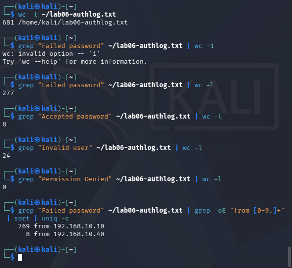

```
    269 from 192.168.10.10
      8 from 192.168.10.40
```

One source accounts for 269 of 277 failures. That alone is not proof of an attack, a broken automated job with a stale password can produce a lopsided count, so the next steps characterize what 192.168.10.10 was actually doing.

**Which accounts it targeted.** Breaking the failures from that address down by username:

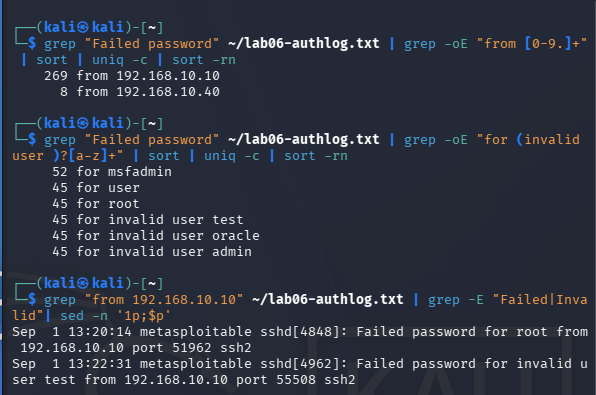

```
     45 for invalid user admin
     45 for invalid user oracle
     45 for invalid user test
     44 for msfadmin
     45 for root
     45 for user
```

Six distinct usernames, roughly 45 attempts each, and three of them (`admin`, `oracle`, `test`) are flagged `invalid user`, meaning no such account exists on this system. A legitimate user or service authenticates as one known account. Cycling through six names, half of which were never valid, is the behaviour of someone guessing blindly at what might be there.

**The rate.** The first and last failure from 192.168.10.10:

```
Sep  1 13:20:14 ... Failed password for root from 192.168.10.10 port 51962 ssh2
Sep  1 13:22:31 ... Failed password for invalid user test from 192.168.10.10 port 55508 ssh2
```

269 attempts across 2 minutes 17 seconds is roughly two per second, sustained. That is machine-driven, not a person at a keyboard.

**Per-connection pattern.** Many of the failures share an `sshd` process ID and source port, meaning several password guesses went down a single TCP connection before it was torn down. SSH permits multiple authentication attempts per connection (six by default), and automated guessers use that allowance to reduce connection overhead. A human reconnecting after each failure does not produce this pattern.

**Whether anything succeeded.** Searching for `Accepted password` from the same address:

```
Sep  1 13:21:41 ... Accepted password for msfadmin from 192.168.10.10 port 45810 ssh2
```

Timestamped in the middle of the failure burst. The attack did not just try, it got in, as `msfadmin`.

A second `Accepted password` from 192.168.10.10 appears later, at `13:29:00`, well after the burst ended. This one is the analyst's own verification login while investigating, not the incident. Separating responder activity from adversary activity is routine, and the timeline (isolated success, no surrounding failures, after the burst) makes the distinction clear.

**The other source.** 192.168.10.40 produced only 8 failures. Its full picture:

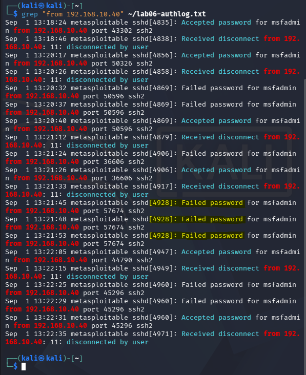

```
Sep  1 13:18:24 ... Accepted password for msfadmin from 192.168.10.40 port 43302 ssh2
Sep  1 13:20:29 ... Failed password for msfadmin from 192.168.10.40 port 50596 ssh2
Sep  1 13:20:32 ... Failed password for msfadmin from 192.168.10.40 port 50596 ssh2
Sep  1 13:20:40 ... Accepted password for msfadmin from 192.168.10.40 port 50596 ssh2
...
Sep  1 13:21:45 ... Failed password for msfadmin from 192.168.10.40 port 57674 ssh2
Sep  1 13:21:48 ... Failed password for msfadmin from 192.168.10.40 port 57674 ssh2
Sep  1 13:21:53 ... Failed password for msfadmin from 192.168.10.40 port 57674 ssh2
Sep  1 13:22:05 ... Accepted password for msfadmin from 192.168.10.40 port 44790 ssh2
```

Six successful logins over four minutes, always the account `msfadmin`, which exists. Never more than three failures on one connection, and every connection ends either in a success or, in the one case of three straight failures on port 57674, a clean drop followed immediately by a fresh connection that succeeds. This is a person occasionally fumbling a password, not an attack.

The failures from 192.168.10.40 are timestamped inside the same window as the attack from 192.168.10.10:

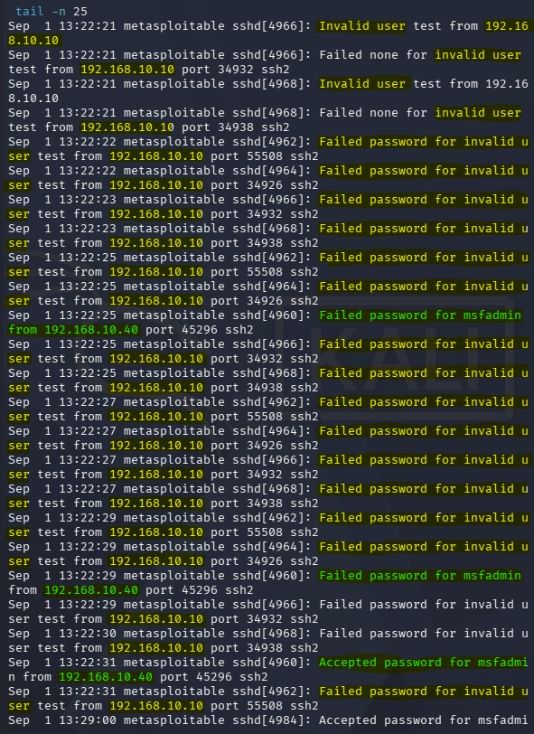

A rule that alarmed on "SSH failures in a time window" without attributing them to a source, or that treated any failure-then-success as suspicious, would flag this user every time.

### Findings

- **Who**: 192.168.10.10, running an automated password guesser. Separately, a legitimate user at 192.168.10.40.
- **What**: an online SSH dictionary attack, roughly 270 password attempts against 6 usernames (3 of them nonexistent) at about 2 per second, which recovered the password for `msfadmin` and logged in successfully.
- **Where**: the SSH service on port 22 of this host.
- **Why**: password authentication is enabled on the SSH service, and the `msfadmin` account uses a weak, guessable password (the account name as its own password). Nothing rate-limits or locks out repeated failures.
- **When**: attack window `Sep 1 13:20:14` to `13:22:31`, successful login at `13:21:41`. Legitimate user activity from 192.168.10.40 runs `13:18:24` to `13:22:35` and overlaps the attack.
- Confidence is high. Volume, rate, username cycling, the `invalid user` ratio, and the multi-guess-per-connection pattern all point the same way, and the `Accepted password` from the attacking address inside the burst confirms this is a compromise, not just an attempt.

### Containment

The common first response is to block 192.168.10.10 at the firewall, or install `fail2ban` to auto-ban addresses after a failure threshold. Both are worth naming because both are routinely reached for, and both are insufficient here.

An IP address is not an identity. The same operator reassigns the Kali VM a new address and repeats the attack in seconds. Real brute-force campaigns already run from many source addresses, botnets and rented hosts, specifically so that per-IP banning becomes whack-a-mole and a slow distributed attempt stays under any per-address threshold. More directly: the attacker already succeeded at `13:21:41`. Blocking further attempts does nothing about the access already obtained.

What actually contains this:

- Treat the `msfadmin` credential as compromised. Rotate it immediately or disable the account, and terminate any active sessions for it. Assume anything `msfadmin` could read or reach is exposed, including via `sudo`.
- Close the guessing surface itself: set `PasswordAuthentication no` in `sshd_config` and move to key-based authentication. This removes the entire attack, regardless of source address or password strength.
- If password authentication has to stay, restrict which hosts can reach port 22 at all with a network allowlist. An allowlist stays effective as an attacker's address changes, where a blocklist does not.

### Recovery

- Rotate `msfadmin`'s password and any other credentials reachable from that account.
- Audit the account for persistence the attacker could have added during the session: new keys in `~/.ssh/authorized_keys`, new local accounts, cron entries, modified shell startup files, changes to `sudoers`. In this exercise none were added, but a responder cannot assume that.
- Review what the session did: shell history, `sudo` calls in `auth.log`, file access times.
- If tampering or persistence cannot be ruled out, rebuild from a known-good snapshot.

### Detection

This activity generates a consistent set of artifacts in `/var/log/auth.log`:

- A high count of `Failed password` from one source in a short window.
- `Failed password for invalid user ...` entries. Legitimate users do not authenticate as accounts that do not exist, so any volume of these from one source is a strong signal on its own.
- Multiple `Failed password` entries sharing one `sshd` PID and source port, that is, several guesses per connection.
- A failure burst immediately followed by `Accepted password` from the same source, which indicates the guessing succeeded.
- Supporting entries from automated clients: `Did not receive identification string from ...` and `Received disconnect ... [preauth]`.

The hard part, shown directly by this dataset, is separating the attack from a legitimate user mistyping a password. No single log line does it. The distinction lives in the aggregate per source: total count, rate, number of distinct usernames, the `invalid user` ratio, and failures per connection. A per-line rule alarms on every fumbled password.

No Sigma rule has been written for this pattern yet. The straightforward candidate is a threshold rule: N `Failed password` events from one source IP within a time window. Its known limits are that a threshold on a single log field misses low-and-slow attempts spread over hours and can false-positive on many users behind one NAT address. The fuller answer is a stateful detector that groups events by source and scores on several features at once, which is what the [ssh-bruteforce-detector](../../../projects/ssh-bruteforce-detector/) project builds against this exact dataset.

As in [04-samba-usermap-script.md](04-samba-usermap-script.md), this is all host-based evidence, recoverable only because it was not tampered with. The `msfadmin` account can `sudo`, so an attacker who used the recovered credential could edit or truncate `auth.log`. Shipping logs off the host in real time is the durable answer, attempted already in [wazuh-siem-attempt.md](../wazuh-siem-attempt.md).

### Mitigation and Prevention

- Disable SSH password authentication and use keys. This removes the technique entirely.
- If passwords are required: enforce a strong password policy, prohibit vendor-style defaults like `msfadmin:msfadmin`, rotate credentials, and add a second factor.
- Restrict port 22 exposure to a known set of administrative sources rather than the whole network.
- Cap authentication attempts and connection rate: `MaxAuthTries`, `MaxStartups`, `LoginGraceTime`. Deploy `fail2ban` as a speed bump, not as the control.
- Disable direct root login (`PermitRootLogin no`).
- Alert on authentication failure spikes per source, and specifically on an `Accepted password` that follows a failure burst from the same source.

---

## Conclusion

### Diamond Model

| Vertex | This incident |
|---|---|
| Adversary | The operator at 192.168.10.10 |
| Capability | An online SSH password dictionary attack via Hydra, sprayed across valid and guessed usernames, succeeding on a vendor-default credential |
| Infrastructure | A single Kali host as the attack origin |
| Victim | The SSH service on 192.168.10.20, and specifically the `msfadmin` account |

The simplest possible shape: one adversary, one host, one capability, one victim. What made the attack succeed was not adversary sophistication, it was the target accepting unlimited password guesses against an account whose password was its own name.

### Pyramid of Pain

Ranking what the investigation recovered, from the indicators hardest for the attacker to give up down to the ones that cost nothing:

| Indicator | Example from this incident | Cost to the attacker of losing it |
|---|---|---|
| TTP | Guessing passwords against exposed SSH password authentication | High. Denying this means the target moved to key-based auth or a second factor, which defeats the technique no matter the tool, wordlist, or source |
| Tools | Hydra plus a `rockyou` wordlist | Low. Medusa, Ncrack, Patator, or a short script do the identical thing |
| Host and network artifacts | The specific usernames tried, the two-per-second rate, the connection burst to port 22 | Cheap. A different username list and a slower pace change all of this |
| IP address | 192.168.10.10 | Trivial. A new address, a VPN, or a botnet defeats per-IP blocking instantly, which is exactly why Containment rejects it |

This is why Containment leads with disabling password authentication, at the top of the pyramid, rather than blocking the address at the bottom.

---

## Notes / Open Questions

- The `msfadmin` account is `sudo`-capable. Privilege escalation to root from the recovered session was not carried out here but is a single command and would be the expected next step in a real intrusion.
- The dataset deliberately contains a legitimate user's failed and successful logins interleaved with the attack, so the [ssh-bruteforce-detector](../../../projects/ssh-bruteforce-detector/) project faces a real discrimination problem instead of a clean burst. Building that detector is the direct follow-up to this exercise.
- The initial pass described in Exploitation is not present in the committed log. Metasploitable2 was reverted to a clean snapshot between the two passes, which removed those entries. Its screenshots (the Hydra result, the packet capture, the auth.log close-up) are kept because the per-attempt and network patterns they show are identical in kind to the full run, only smaller. The committed log holds the full run plus the legitimate `alpine-endpoint` sessions.
- Low-and-slow brute force, a few attempts per hour spread across many source addresses, is not represented in this dataset and is the harder detection case. Candidate for a follow-up exercise once the threshold detector exists and its blind spot can be shown concretely.
- The legacy algorithm negotiation work in Weaponization is worth keeping in full. It is a current, recurring obstacle when administering or assessing older systems, not a quirk of this one host, and the same target needed different flags for the OpenSSH 4.7 era client fixes versus the OpenSSH 10.3 client.
- Next Metasploitable2 service per [ROADMAP.md](../../../ROADMAP.md): the UnrealIRCd backdoor on port 6667.
